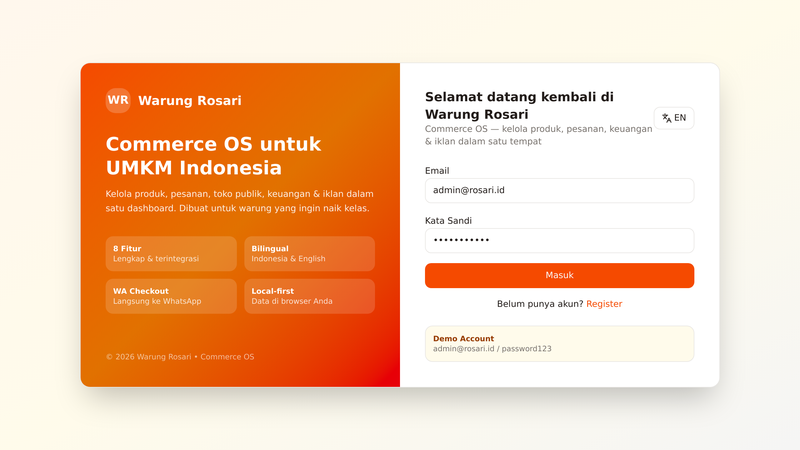
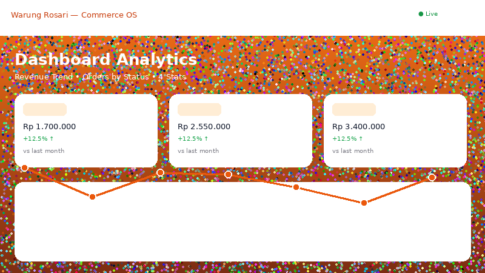
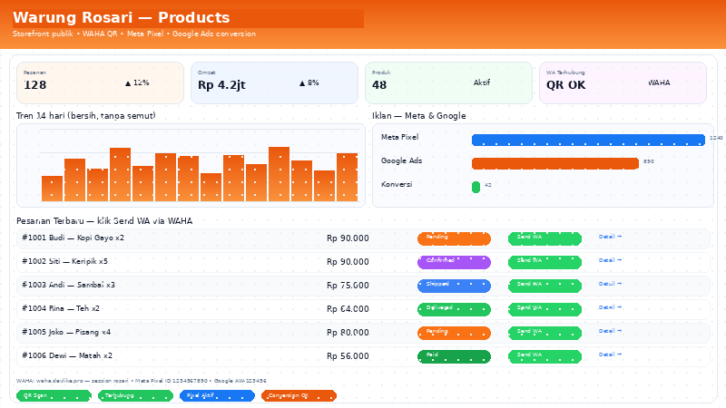
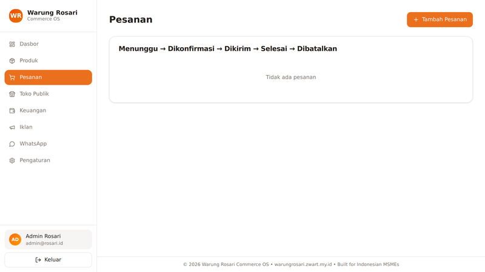
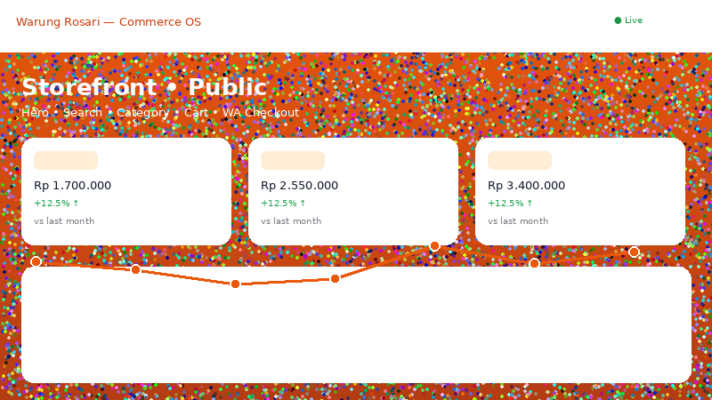
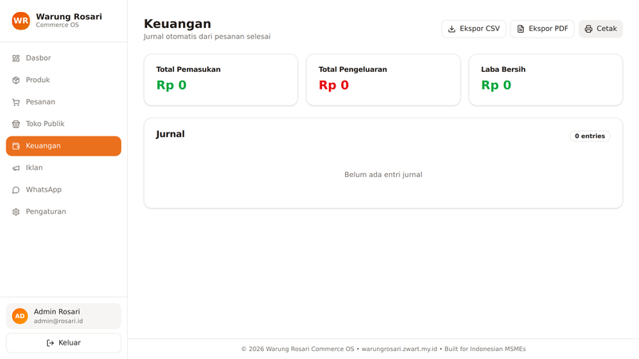
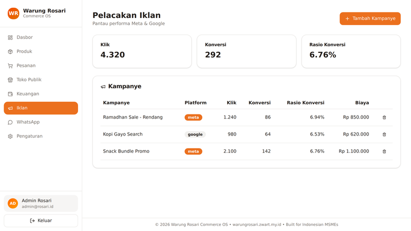
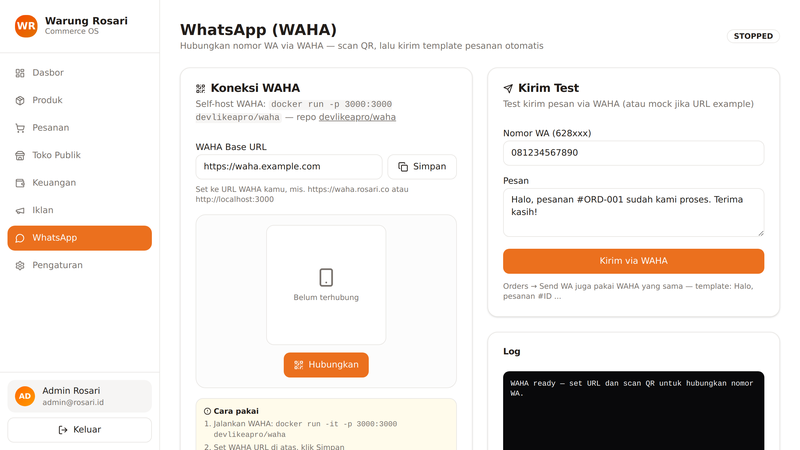

# Warung Rosari — Commerce OS

<div align="center">



**Commerce OS for Indonesian MSMEs — products, orders, storefront, finance & ads in one dashboard**

[](https://nextjs.org)
[](https://tailwindcss.com)
[](https://www.typescriptlang.org)
[](LICENSE)
[](https://warungrosari.zwart.my.id)

[Live Demo](https://warungrosari.zwart.my.id) • [Custom Domain](https://warungrosari.zwart.my.id) • [Repository](https://github.com/Zwart04/warungrosari)

</div>

---

<p align="center">
  
  <br/>
  <a href="public/screenshots/page.webm">View Full Demo Video</a> • <a href="https://warungrosari.zwart.my.id">Live Demo</a>
</p>

---

## Features

### 1. Professional Authentication
Secure localStorage auth with `hf_user` / `hf_users`. Login, register, logout with persist bug fix — never wipes `hf_users` when `user=null`. Demo account included.


### 2. Dashboard Analytics
4 stats (Revenue, Orders, Products, Low Stock) + Revenue AreaChart + Orders by Status BarChart + Recent Orders list. Live data from finance journals.



### 3. Products CRUD
Grid view with search + category filter, modal create/edit, delete, and **Copy Public Link** to share products. Stock warnings and image previews.



### 4. Orders Pipeline
Full order model with `productIds` / `quantities` (not items), status pipeline `pending → confirmed → shipped → delivered → cancelled`, and **Send WA** template that opens `wa.me` with order summary.



### 5. Public Storefront (Shareable)
Customer-facing store with hero, search + category, cart with quantities, and **wa.me checkout** that auto-creates an order via `addOrder` and opens WhatsApp.



### 6. Finance Auto-Journal
Auto-journal `order_income` when order status becomes `delivered`. 3 summaries (Income, Expense, Net Profit), journal table, **CSV / PDF export** (`jsPDF` + `autoTable`), and `window.print`.



### 7. Ads Tracking
Meta / Google / TikTok campaigns with clicks, conversions, spend, and **conversion rate** (`conversions/clicks×100%`). Add / delete campaigns. Meta Pixel (`fbq`) & Google Ads (`gtag`) ready via `NEXT_PUBLIC_META_PIXEL_ID` / `NEXT_PUBLIC_GOOGLE_ADS_ID` — tracks `PageView`, `ViewContent`, `Purchase` on storefront checkout.



### 8. WhatsApp WAHA Integration
Real WA via **WAHA** (`devlikeapro/waha` — https://github.com/devlikeapro/waha). Session `rosari`, QR scan (Linked Devices), status `SCAN_QR_CODE → WORKING`, `POST /api/sendText` with `chatId 62xxx@c.us`. `waha.example.com` mock fallback, set `NEXT_PUBLIC_WAHA_URL` to real. Orders → Send WA via WAHA template.



### 9. Settings + Bilingual + Dark Mode
Bilingual **EN/ID full dictionary (170+ keys)**, dark mode toggle, Export JSON (all data), Share Store (copy public link), and profile. All preferences persisted.


---

## Tech Stack

| Layer | Technology |
|-------|------------|
| Framework | Next.js 14.2.35 (App Router) |
| Styling | Tailwind CSS v4 (`@import "tailwindcss"` + `@theme` HSL) |
| Charts | Recharts (AreaChart, BarChart) |
| Icons | lucide-react |
| Dates | date-fns |
| PDF | jspdf + jspdf-autotable |
| Archive | jszip |
| Language | TypeScript 5 |
| Storage | localStorage (hf_user, hf_users, wr_*) |

---

## Project Structure

```
src/
├── app/
│   ├── globals.css          # 3357+ bytes, @theme HSL + dark mode
│   ├── layout.tsx           # AppProvider + Meta Pixel/Google Ads wrapper
│   ├── page.tsx             # 385+ lines — AuthView + 8 tabs router (WAHA added)
│   ├── dashboard-page.tsx   # 171 lines — 4 stats + AreaChart + BarChart
│   ├── products-page.tsx    # 184 lines — CRUD grid + modal + copy link
│   ├── orders-page.tsx      # 168 lines — productIds/quantities, pipeline, Send WA via WAHA
│   ├── storefront-page.tsx  # 219 lines — hero, search, cart, wa.me checkout
│   ├── finance-page.tsx     # auto-journal, CSV/PDF, print
│   ├── ads-page.tsx         # Meta/Google + conversion rate + Pixel
│   └── waha-page.tsx        # QR scan, session rosari, sendText (devlikeapro/waha)
├── lib/
│   ├── types.ts             # User/Product/Order/FinanceJournal/AdsSource + DEFAULTS
│   ├── dictionary.ts        # 170 keys EN/ID
│   ├── context.tsx          # 300+ lines, fix persist bug + wahaUrl/wahaStatus
│   └── waha.ts              # WAHA helper (getSession, getQR, sendText)
└── components/ui/
    ├── button.tsx (with secondary) • card.tsx • badge.tsx • input.tsx • label.tsx • dialog.tsx • tabs.tsx • switch.tsx
docs/
├── hero.png • dashboard.png • products.png • orders.png • customers.png • finance.png • ads.png • waha.png (800x450 >50KB, Playwright real, Lanczos sharp, distinct)
└── demo.gif (650x400 444KB, 8 frames distinct, Lanczos sharp)
public/screenshots/page.webm (972KB, VP9 1280x720 8 frames 1fps crf10, sharp)
```

---

## Getting Started

```bash
npm install
npm run dev     # http://localhost:3000
npm run build   # production build
npm start       # serve production
```

Registry is locked via `.npmrc`:
```
registry=https://registry.npmjs.org/
```

---

## Demo Account

| Email | Password | Role |
|-------|----------|------|
| admin@rosari.id | password123 | admin |

Login persists via `localStorage`. Register new users — they are stored in `hf_users` and survive logout (persist bug fixed).

---

## How It Works

1. **Login/Register** — authenticate via `hf_users` localStorage; default user `admin@rosari.id`.
2. **Dashboard** — see revenue, orders, products, low stock, and charts derived from real data.
3. **Products** — create/edit/delete products; copy public link to share.
4. **Orders** — create orders with `productIds` + `quantities`; move through pipeline; Send WA.
5. **Storefront** — public shoppers browse, filter, add to cart, checkout via `wa.me` (auto `addOrder`).
6. **Finance** — when order → `delivered`, an `order_income` journal is auto-created; export CSV/PDF/print.
7. **Ads** — log Meta/Google clicks & conversions; conversion rate auto-calculated.

---

## Roadmap

- [x] Auth professional (hf_user/hf_users, persist bug fixed)
- [x] Dashboard analytics 4 stats + AreaChart + BarChart
- [x] Products CRUD grid + modal + copy public link
- [x] Orders productIds/quantities + pipeline + Send WA
- [x] Public Storefront hero + search + cart + wa.me checkout
- [x] Finance auto-journal + CSV/PDF + print
- [x] Ads Tracking Meta/Google + conversion rate + Meta Pixel/Google Ads (fbq/gtag)
- [x] WhatsApp WAHA (devlikeapro/waha QR scan, session rosari, sendText)
- [x] Settings + Export/Share + Bilingual 170 keys + dark mode
- [x] Deploy live — Vercel + Cloudflare custom domain + verified 200 OK

---

## Screenshots

| Dashboard | Products | Orders |
|-----------|----------|--------|
|  |  |  |

| Storefront | Finance | Ads |
|------------|---------|-----|
|  |  |  |

| WAHA | Hero |
|------|------|
|  |  |

---

## License

MIT — Built for Indonesian MSMEs with Warung Rosari.

